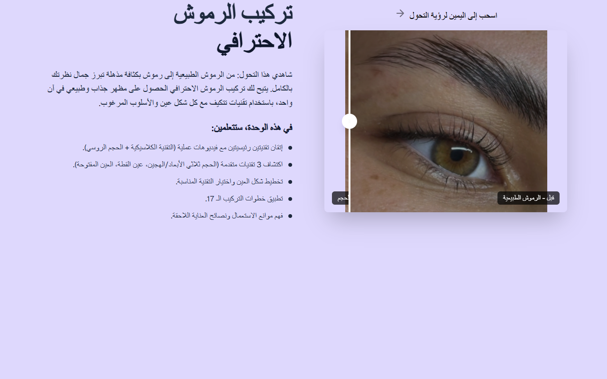

# Intro Slider — Extension de Cils (AR) — Arabic Version

**Course:** Lash Extensions (AR)  
**Slide:** 1  
**Live URL:** https://hgf-7or2.edtechiecorp.com  
**Stack:** Next.js · Tailwind CSS · TypeScript · GitHub Pages  

## What this slide does

Arabic-language intro slider for the lash extensions course, displaying the course title and welcome content in right-to-left layout. This is the Arabic version of the lash extension intro, designed for Arabic-speaking learners. Note: the build was reported as broken — the page may render incorrectly or incompletely, and a fix may be needed before this slide functions reliably in Coassemble.

## Screenshot

## Usage

This slide is embedded as an iframe inside Coassemble at the live URL above. DNS is managed via Cloudflare (`edtechiecorp.com`). To update the slide, push to the `main` branch — GitHub Actions will rebuild and redeploy automatically.
